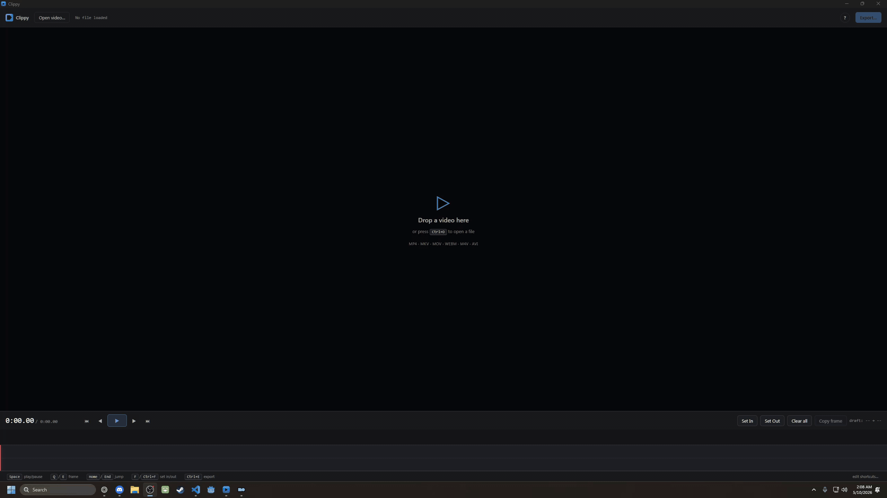
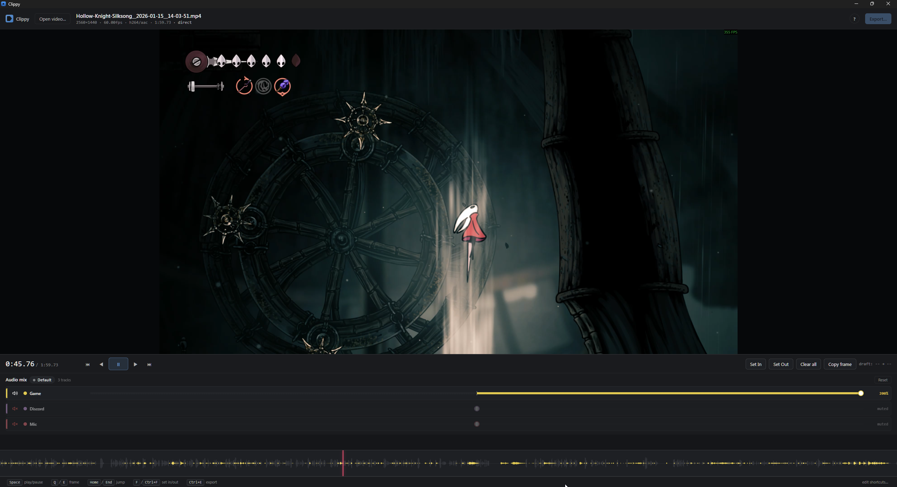
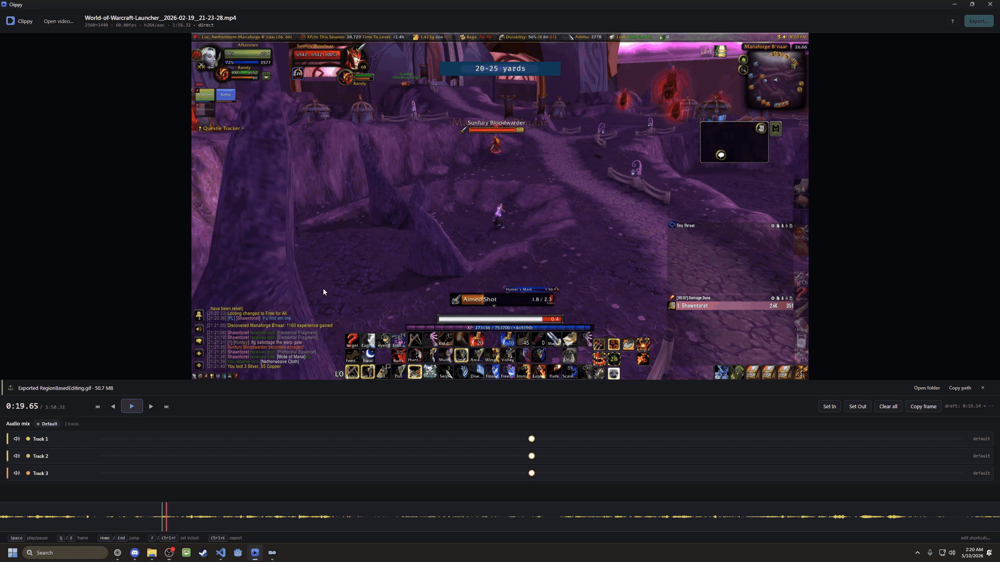
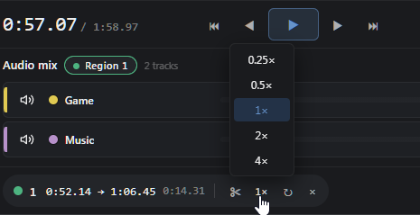
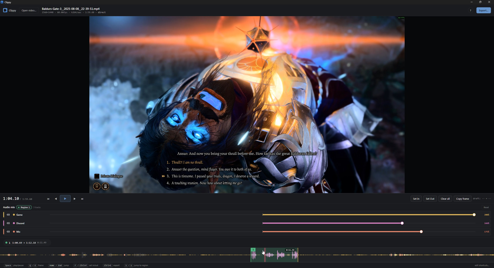
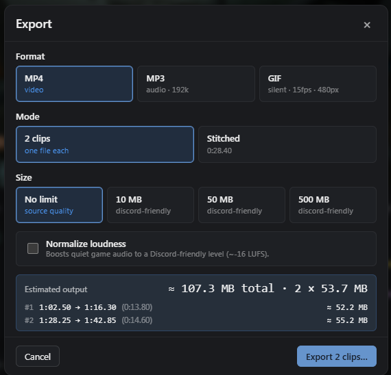
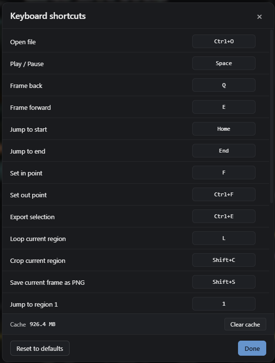
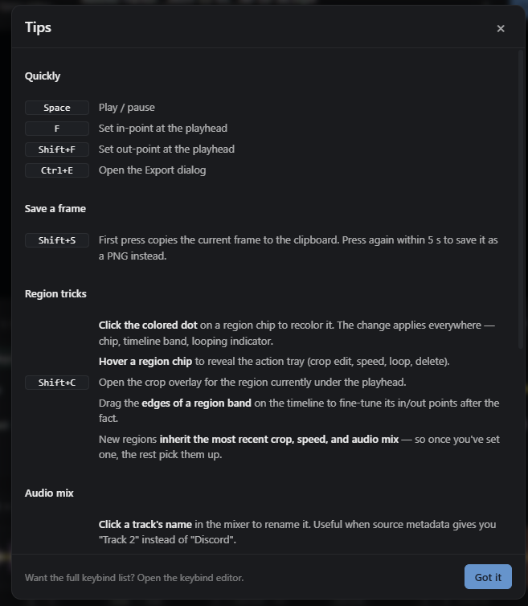

# Clippy

**A focused video clip editor for Windows.** Open a recording, mark the moments you want, and export as MP4, MP3, or GIF in seconds.

For editing a clip to send to buddies on discord, the options I had for video editing tools felt like cutting a steak with either a plastic knife or a chainsaw. The tools were either too complicated, or too simple. Clippy is the sweet middle ground.



---

## Features

### Open anything, instantly

Drop a video file onto the window, drag it onto the `.exe`, or use **Ctrl+O**. MP4/H.264/AAC files play immediately — no re-encode on load. MKV and other containers remux in the background while you work, so you can start trimming before the background job finishes.



---

### Region-based editing

Press **F** to mark an in-point at the playhead, **Shift+F** to mark the out-point. Regions appear as color-coded bands on the timeline and as chips above it. Build as many as you need — each is independent.


- Drag the edges of a region band on the timeline to fine-tune in/out after the fact
- Jump to any region instantly with number keys (**1–9**)
- Delete a region by clicking the **×** on its chip

---

### Per-region crop

Press **Shift+C** (or click **Crop** on a region chip) to open the crop overlay. Draw a rectangle over the video, lock to a preset aspect ratio, and confirm. The crop is baked in at export — the rest of the frame is discarded.



| Aspect lock | Use case |
|-------------|----------|
| 16:9 | Standard widescreen |
| 9:16 | TikTok / Reels / Shorts |
| 1:1 | Square posts |
| 4:3 | Retro / webcam |
| Free | Any shape |
| Source | Match the source video |

---

### Per-region speed

Click the speed badge on a region chip (shown as **1×** by default) to change playback rate: **0.25×, 0.5×, 1×, 2×, 4×**. Audio is pitch-corrected automatically at export using the `atempo` filter.



---

### Multi-track audio mixer

If your source has multiple audio tracks (SteelSeries Sonar, OBS multi-track, or any multi-audio container), the mixer panel appears below the video. Each track gets a color-coded row with a volume slider and a mute button.



- **Click a track's colored dot** to recolor it — the same color appears on the row stripe, the slider thumb, and that track's waveform layer on the timeline
- **Click a track's label** to rename it inline (turn "Track 2" into "Discord")
- **The mixer follows the playhead:** inside a region, you're editing that region's audio mix; outside, you're editing the source default — you hear the mix change live as the playhead crosses a region boundary

---

### Export to MP4, MP3, or GIF 

Open the export panel with **Ctrl+E**.



**MP4** — Hardware-accelerated encode using the best encoder your GPU supports (NVENC → AMF → QSV → libx264 software fallback). Export regions as separate clips or stitched into one file. Optional size target (10 MB, 50 MB, 500 MB, or none) for Discord's upload limits.

**MP3** — Audio-only, 192 kbps. All regions are stitched in timeline order.

**GIF** — Silent looping animation at 15 fps. Resolution presets: Small (480 px wide), Medium (960 px), Large (1280 px), or source width.

**X Clips or Stitched** — Export as many files as you selected, or stitch them together into one 

**Normalize loudness** — One checkbox to bring quiet game audio up to a Discord-friendly level (~−16 LUFS target) without touching the per-track mixer.

---

### Replay buffer (Windows-only)

Continuously captures the last few minutes of focused gameplay in the background, ShadowPlay-style. Press your save hotkey at any moment and Clippy flushes the buffer to an MP4 that auto-opens in the editor.

**Default hotkey: `Alt+F10`** (global — works while the game is focused). Rebindable from the keybind editor.

Open **Settings** (gear icon in the keybinds modal) → **Replay buffer**. From there you can:

- **Start / stop the buffer** and toggle "Start the replay buffer when Clippy launches"
- **Capture mode** — Per-window (only allowlisted games, switches with focus, parallel buffers per game) or Full screen (one specific monitor, captures everything including alt-tabs)
- **Buffer duration** — 1 to 10 minutes
- **Quality & performance** — FPS (30/60/120/144/240), resolution (Source / Half / Custom), bitrate presets (Low/Medium/High/Ultra), encoder pick (Auto/NVENC/AMF/QSV/Software), keyframe interval, and a cap on simultaneously-captured games (LRU eviction past the cap)
- **Audio sources** — checklist of WASAPI render endpoints to capture as separate tracks in the MP4. Tick "Try to capture only the focused game's audio" on Windows 11 22H2+ to use Process Loopback (falls back to system audio elsewhere). Inline rename per device so saved clips have meaningful track names
- **System integration** — "Start Clippy when Windows starts" and "Close to system tray (keep Clippy running in the background)"
- **Resource calculator** — live estimate of file size, RAM, and VRAM per active game, plus a green/yellow/red capability hint for the chosen encoder × resolution × FPS combination

**Game allowlist (per-window mode)**

The buffer only captures windows whose process is in your allowlist. Steam games auto-detect on launch. For non-Steam titles (Battle.net, Riot, Epic, itch.io, DRM-free, etc.):

- Click **Rescan launchers** to refresh
- Use **Add current foreground (3s delay)** — countdown gives you time to alt-tab to your game, then Clippy snapshots the foreground process
- Use **Add by .exe path…** to pick the executable directly

---

### Keyboard shortcuts — rebindable

Every action is bound to a key. Click any shortcut label in the footer to open the keybind editor and remap it to whatever you prefer.



Default bindings:

| Action | Default key |
|--------|-------------|
| Play / pause | Space |
| Frame back | ← |
| Frame forward | → |
| Jump to start | Home |
| Jump to end | End |
| Set in-point | F |
| Set out-point | Shift+F |
| Open crop overlay | Shift+C |
| Copy frame / save PNG | Shift+S |
| Export | Ctrl+E |
| Open file | Ctrl+O |
| Save replay buffer (global) | Alt+F10 |
| Jump to region 1–9 | 1–9 |

---

### Tips modal

Hit the **?** button in the top bar to pull up a curated list of things that aren't obvious from just looking at the UI.



---

## Installation

**Recommended:** Download `Clippy_0.1.0_x64-setup.exe` from the [Releases](../../releases) page and run the installer. It bundles the FFmpeg sidecars and handles WebView2 if needed.

**Portable:** Download `clippy.exe` from Releases, put it anywhere on your machine, and run it. FFmpeg/FFprobe must be on `PATH` or in the same directory as the exe.

### System requirements

| | Minimum |
|--|---------|
| OS | Windows 10 x64 |
| Runtime | WebView2 (pre-installed on Windows 11; auto-installed on Windows 10 by the NSIS installer) |
| GPU | Any (for playback). NVIDIA / AMD / Intel GPU recommended for hardware-accelerated export. |

---

## Usage

1. **Open a video** — drag it onto the window, drag it onto `clippy.exe`, or press **Ctrl+O**
2. **Scrub** — drag the timeline or use ← / → to find your moments
3. **Set regions** — press **F** at the start of a clip, **Shift+F** at the end; repeat for every clip you want
4. **Adjust per-region** — crop (**Shift+C**), speed (click the badge on the chip), audio mix (the mixer tracks your playhead automatically)
5. **Export** — **Ctrl+E**, pick format + size limit, go

---

## Technical notes

- **No cloud. No telemetry.** Everything runs locally. FFmpeg/FFprobe are bundled as sidecars and never touch the network.
- **Proxy cache** lives at `%APPDATA%\Clippy\proxies\`. Files older than 30 days are pruned automatically. You can clear it manually via the link in the app footer.
- **Export is two-stage:** each region is stream-copied (or re-encoded only when a crop or non-unity speed is applied) into a clean intermediate file, then the intermediates are concatenated. This keeps export fast and lossless when possible.
- **Audio preview uses the WebAudio API.** Waveform rendering and live mix preview run inside the WebView — no extra process.
- **Hardware encoder waterfall:** the backend tries NVENC, then AMF, then QSV, then falls back to libx264. The first one that initializes wins.

---

## Troubleshooting

**Replay buffer not capturing your game?**

The most useful thing to attach to a bug report is the in-app diagnostics. Open the keybind editor → click **Copy diagnostics**. It contains the GPU adapter name + VRAM, detected hardware encoders, audio devices, monitor list, recent event log, and a 30-second performance rollup per active worker. No file paths, no window titles for non-game windows (toggleable under **Verbose diagnostics** if you're chasing a routing bug).

**Hardware smoke test**

The installer ships a standalone `clippy-self-test.exe` next to `clippy.exe` that exercises every subsystem in isolation and prints structured PASS/FAIL output (JSON by default, `--pretty` for human-readable). Use it to confirm a clean install or before opening a ticket:

```sh
"%PROGRAMFILES%\Clippy\clippy-self-test.exe" --pretty
```

It checks: D3D11 device, sysinfo probe, monitor enumeration, WGC monitor + window capture, Media Foundation startup, WASAPI render endpoints, game allowlist scan, hardware encoder enumeration, and Process Loopback (Win11 22H2+). Process Loopback may report FAIL in the standalone harness even when it works in the running app — see the message printed for context.

**Persisted log**

A graceful exit appends the in-memory diag log to `%APPDATA%\Clippy\diagnostics.log` with a session-end header — handy when a crash bypasses the in-app copy button.

---

## Building from source

**Prerequisites:** [Rust](https://rustup.rs/), [Node.js 20+](https://nodejs.org/), [pnpm](https://pnpm.io/), and FFmpeg/FFprobe.

**FFmpeg sidecars** are not included in this repo (LGPL). Download a Windows x64 build from [gyan.dev](https://www.gyan.dev/ffmpeg/builds/) (the `ffmpeg-release-essentials` zip is sufficient), then copy and rename the two executables into `clippy/src-tauri/binaries/`:

```
ffmpeg.exe  →  clippy/src-tauri/binaries/ffmpeg-x86_64-pc-windows-msvc.exe
ffprobe.exe →  clippy/src-tauri/binaries/ffprobe-x86_64-pc-windows-msvc.exe
```

```sh
git clone https://github.com/yourname/clippy
cd clippy/clippy
pnpm install
pnpm tauri dev        # dev mode with hot reload
pnpm tauri build      # production → target/release/bundle/nsis/
```

---

## License

MIT — see [LICENSE](LICENSE).
